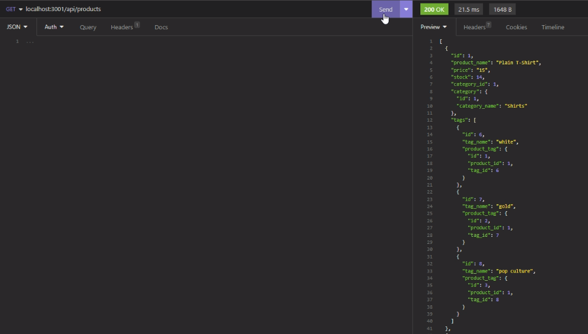

# Nux Mercatura X

## URL: https://drive.google.com/file/d/13mi1u1cgKMZ_Du1iKaIe-H8bIpL99-Ht/view

## Description

ORM: E-commerce Back-end

## Installations

Please install the following through your terminal:

```
npm i
```

## Usage

<ul>
<li>
To test, seed the needed data by running the integrated terminal through the seeds folder and type the following: 

```
node index.js
```
</li>
<li>
Then run the integrated terminal in the main folder and:

To run the server, please run the integrated terminal through the main folder abd type the following: 

```
node server.js
```
</li>
<li> The GET, POST, PUT, and DELETE routes should be functional</li>
</ul>

## Screenshot

Below is a sample test of the application:



## Credits

The following programs / guides were used to create this project:

<ul>
<li>Node.js - https://nodejs.org/en/</li>
<li>Mysql2 - https://www.npmjs.com/package/mysql2</li>
<li>Sequelize - https://www.npmjs.com/package/sequelize</li>
<li>dotenv - https://www.npmjs.com/package/dotenv</li>
<li>Express - https://www.npmjs.com/package/express</li>
</ul>

Thank you to the instructors and TA's that helped with this project.

## License

N/A